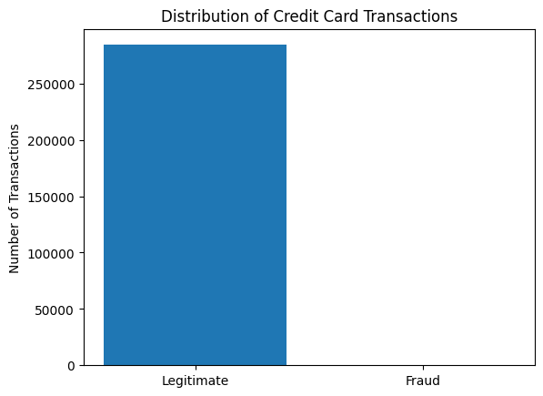
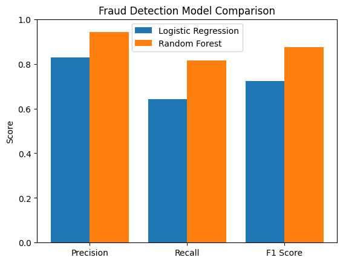
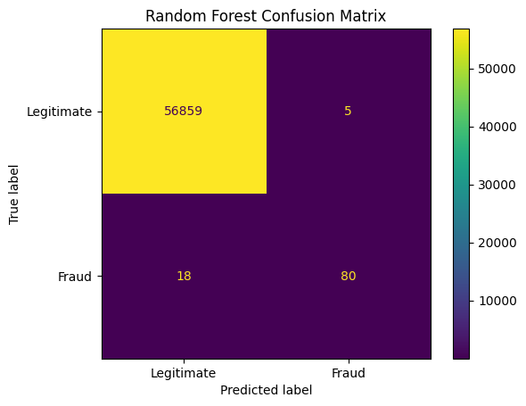

# Credit Card Fraud Detection

A machine learning project that detects fraudulent credit card transactions using Scikit-learn. The project compares Logistic Regression and Random Forest classifiers on a highly imbalanced real-world transaction dataset.

## Overview

Credit card fraud detection is a classification problem where fraudulent transactions represent only a very small portion of all transactions.

This project explores how machine learning can be used to identify fraudulent transactions while accounting for this class imbalance. Two classification models were trained and evaluated:

- Logistic Regression
- Random Forest

Rather than relying only on accuracy, the models were compared using precision, recall, F1-score, and confusion matrices.

## Dataset

The project uses the **Credit Card Fraud Detection** dataset available on Kaggle.

The dataset contains **284,807 transactions**, including:

- 284,315 legitimate transactions
- 492 fraudulent transactions
- 30 input features
- `Class` as the target variable
  - `0` = legitimate transaction
  - `1` = fraudulent transaction

Only approximately **0.17% of the transactions are fraudulent**, making the dataset highly imbalanced.

### Class Distribution



## Machine Learning Pipeline

The project follows a simple supervised machine learning workflow:

1. Load and explore the transaction dataset.
2. Separate the input features (`X`) from the target (`y`).
3. Split the data into 80% training and 20% testing sets.
4. Use stratified sampling to preserve the fraud-to-legitimate transaction ratio.
5. Standardize features used by Logistic Regression.
6. Train Logistic Regression and Random Forest classifiers.
7. Make predictions on unseen test data.
8. Evaluate both models using precision, recall, F1-score, and confusion matrices.
9. Compare model performance.

## Model Comparison

The Random Forest classifier performed better at identifying fraudulent transactions in the test set.

| Model | Precision | Recall | F1-Score |
| --- | ---: | ---: | ---: |
| Logistic Regression | 0.83 | 0.64 | 0.72 |
| Random Forest | 0.94 | 0.82 | 0.87 |

> Metrics shown are for the fraudulent transaction class (`Class = 1`).



## Random Forest Results

The Random Forest confusion matrix was:

- **56,859** legitimate transactions correctly classified
- **80** fraudulent transactions correctly detected
- **5** legitimate transactions incorrectly flagged as fraud
- **18** fraudulent transactions missed



The model therefore detected approximately **82% of fraudulent transactions in the test set**, while maintaining a fraud precision of approximately **94%**.

## Technologies

- Python
- Pandas
- NumPy
- Scikit-learn
- Matplotlib

## Running the Project

### 1. Clone the repository

```bash
git clone <repository-url>
cd fraud-transaction-detector